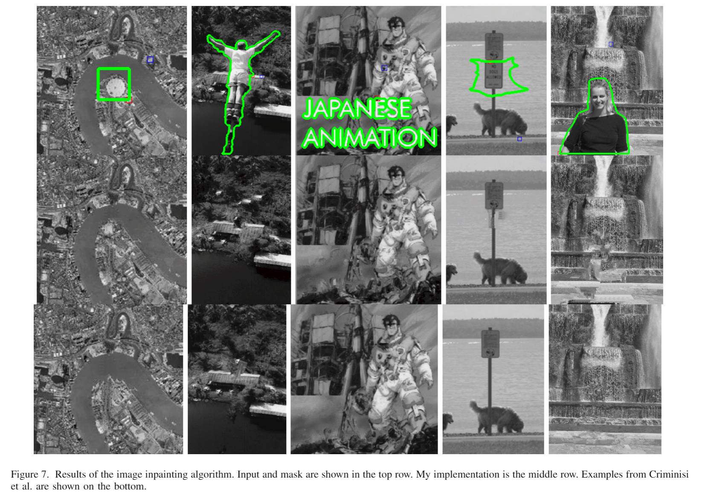

# image-inpainting
Implementation of [Region Filling and Object Removal by Exemplar-Based Image Inpainting](https://ieeexplore.ieee.org/document/1323101) by Criminisi et al. View the full [project report here.](https://www.luisjguzman.com/media/EE5561/image_inpainting.pdf)

Code can be run with `python main.py`

New images must be placed in the images folder and the mask must be placed in the mask folder. Masks must start with the image filename and end with `_mask.jpg`. An example image is provided.

The output images are given in the output folder. A visualization of the inpainted image and the confidence values are saved every 20 iterations so you can see how the algorithm is progressing. After the algorithm finishes, the final image will be `{filename}_final.png`
